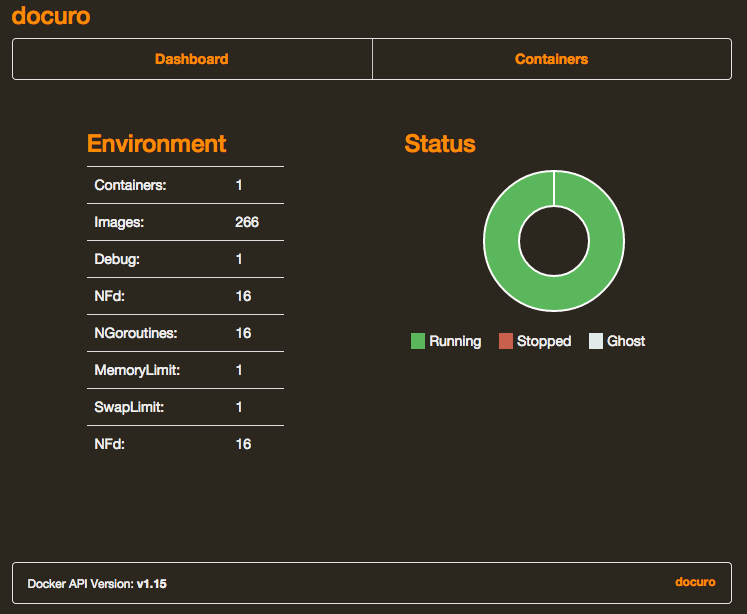

#docuro
docuro is a web interface to interact with the docker Remote API. It is based on [crosbymichael/dockerui](https://github.com/crosbymichael/dockerui).

##Usage

###Quickstart using Docker
<pre>
docker run -d -p 10443:10443 -v /var/run/docker.sock:/var/run/docker.sock n3r0ch/docuro
</pre>

Open your browser to http://<dockerd host ip>:10443

Bind mounting the unix socket into the docuro container is much more secure than exposing your docker daemon over tcp. 

###Quickstart using fig
Add the following lines to your `fig.yml`.
<pre>
docuro:
  image: n3r0ch/docuro
  ports:
    - "10443:10443"
  volumes:
    - /var/run/docker.sock:/var/run/docker.sock
</pre>

###Build and run local
<pre>
make install
docker run -d -p 10443:10443 -v /var/run/docker.sock:/var/run/docker.sock n3r0ch/docuro
</pre>

####Additional Requirements
* Grunt
* make

##Login
<pre>
User:		docuro
Password:	docuro
</pre>

##Changing configuration

###Authorization
1. Replace `.htpasswd` file at docuro config location folder (e.g. ./config/auth)
2. Generate new credentials
	- via `htpasswd` shell command
	<pre>
	htpasswd -c ~/dockerui/.htpasswd [username]
	</pre>
	- or via one of these websites [htpasswd generators](http://goo.gl/yLfKmV) (opens google search)
3. Rebuild and rerun Docker container

###Replace SSL certificates
1. Replace the folder for SSL certificates docuro config folder (e.g. ./config/auth)
2. Generate new certificates
	<pre>
	openssl req -new -newkey rsa:4096 -days 365 -nodes -x509 -subj "/C=US/ST=Unknown/L=Unknown/O=Dis/CN=localhost" -keyout ~/dockerui/ssl/server.key  -out ~/dockerui/ssl/server.crt
	</pre>
	**PLEASE NOTE: Key and certificate file names (`server.key` and `server.crt`) should not be changed**

3. Rebuild and rerun Docker container

##License
The MIT License (MIT)

Copyright (c) 2014 Felix Imobersteg

Permission is hereby granted, free of charge, to any person obtaining a copy
of this software and associated documentation files (the "Software"), to deal
in the Software without restriction, including without limitation the rights
to use, copy, modify, merge, publish, distribute, sublicense, and/or sell
copies of the Software, and to permit persons to whom the Software is
furnished to do so, subject to the following conditions:

The above copyright notice and this permission notice shall be included in all
copies or substantial portions of the Software.

THE SOFTWARE IS PROVIDED "AS IS", WITHOUT WARRANTY OF ANY KIND, EXPRESS OR
IMPLIED, INCLUDING BUT NOT LIMITED TO THE WARRANTIES OF MERCHANTABILITY,
FITNESS FOR A PARTICULAR PURPOSE AND NONINFRINGEMENT. IN NO EVENT SHALL THE
AUTHORS OR COPYRIGHT HOLDERS BE LIABLE FOR ANY CLAIM, DAMAGES OR OTHER
LIABILITY, WHETHER IN AN ACTION OF CONTRACT, TORT OR OTHERWISE, ARISING FROM,
OUT OF OR IN CONNECTION WITH THE SOFTWARE OR THE USE OR OTHER DEALINGS IN THE
SOFTWARE.